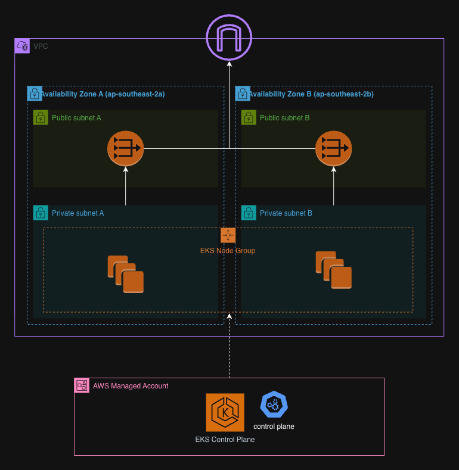
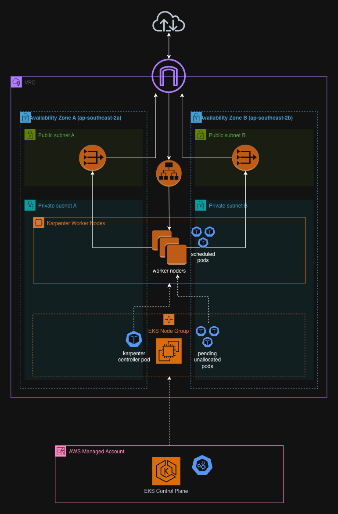

# Roommate App

## /infra

Our application runs on a Kubernetes cluster with Karpenter handling autoscaling. This directory provisions the AWS platform it runs using CloudFormation, and deploys the Kubernetes workloads on top of it using Helm.

Note that this is more infrastructure than an app this size actually needs, it could run with a more lightweight setup. The setup exists mainly as a technical showcase of EKS, Karpenter, and the surrounding AWS ecosystem.

### /infra/cfn

CloudFormation stacks that deploy our AWS platform.

#### `networking.yaml`

- **VPC**
- **Public + Private Subnets**
- **Internet Gateway**
- **NAT Gateway(s)**
- **Route Tables**

<b>Diagram</b>

 

#### `eks.yaml`

- **EksClusterRole:** Lets the EKS control plane call other AWS APIs on your behalf
- **NodeInstanceRole:** Lets worker nodes register with the cluster, use the VPC CNI, pull images from ECR, and be managed via SSM
- **EKS Cluster:** The AWS managed control plane that runs and coordinates the cluster, targets all subnets in our VPC
- **Managed Node Group:** ASG of EC2 nodes that run the pods, placed in the private subnets
- **OIDC Provider:** Enables IRSA, so a pod's service account can assume its own specific IAM role instead of inheriting the whole node's shared role
- **ACM Certificate:** Requested and DNS-validated upfront so that it's ready for when Ingress needs it later on in deployment

<b>Diagram</b>

<em>Note that our node group has a 'DesiredSize' of 1, so only 1 node is actually deployed in this ASG
</em>

 

#### `karpenter.yaml`

- **Karpenter Node IAM Role:** Role given to EC2 nodes Karpenter launches so they can join the cluster
- **Karpenter Controller IAM Policy + Role:** Role given to Karpenter controller pods such that they can create and destroy EC2 nodes, can only be assumed via IRSA by pods with Karpenter service account
- **SQS Interruption Queue:** Receives spot interruption, instance health, and rebalance events so Karpenter can react before a node disappears
- **EventBridge Rules:** Forwards AWS events into the interruption queue
- **Node Security Group:** Controls what traffic is allowed to/from Karpenter provisioned nodes and the control plane

 

#### `cognito.yaml`

- **Cognito User Pool:** Directory of users including accounts, passwords, verified emails, federated identities
- **Google Identity Provider:** Lets users log in with an existing Google account instead of creating a new password. This is associated with our user pool
- **User Pool Domain:** Hosted UI for login
- **User Pool Client:** Config that strings together our domain, user pool, and identity providers. Will be used by our ALB

---

### /infra/helm

Helm charts, deploy the Kubernetes workloads on top of our AWS infrastructure.

#### `karpenter/`

Config that tells our Karpenter controller what it is allowed to launch.

- **EC2NodeClass:** Environment Karpenter nodes are built into. Identity, network placement, and the base image
- **NodePool:** Instance specs for Karpenter nodes. Shape of instance (arch, pricing model, size category) and how much of it the pool is allowed to produce

[!NOTE]
Requires the **Karpenter controller** public AWS Helm chart to be deployed onto our cluster before this configuration does anything.

<b>Diagram</b>

<em>Provides the instructions/config that enable Karpenter worker nodes to be created
</em>

 

#### `app/`

Deploys the actual application onto the infra (with the exception of the Ingress which itself deploys new infra).

- **Backend/Redis:** Replica pods (2 by default) running a container image, load-balanced internally via a ClusterIP Service
- **Frontend:** The same pattern (replica pods + ClusterIP Service), plus an Ingress in front of it. Provisions an ALB, attaches TLS + Cognito auth, and makes our cluster reachable from the internet

[!NOTE]
For our frontend Ingress to function here we first need to deploy the **Load Balancer Controller** public AWS Helm chart along with its associated IAM resources.

<b>Diagram</b>

<em>App pods will trigger Karpenter to create worker nodes where there are not sufficient resources for pending pods
</em>

