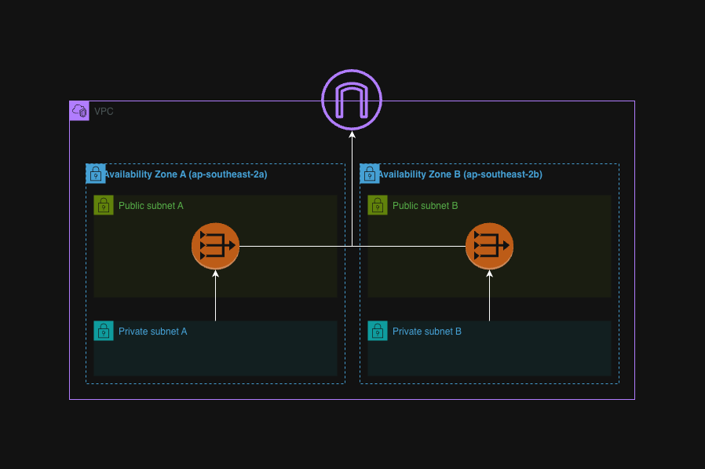
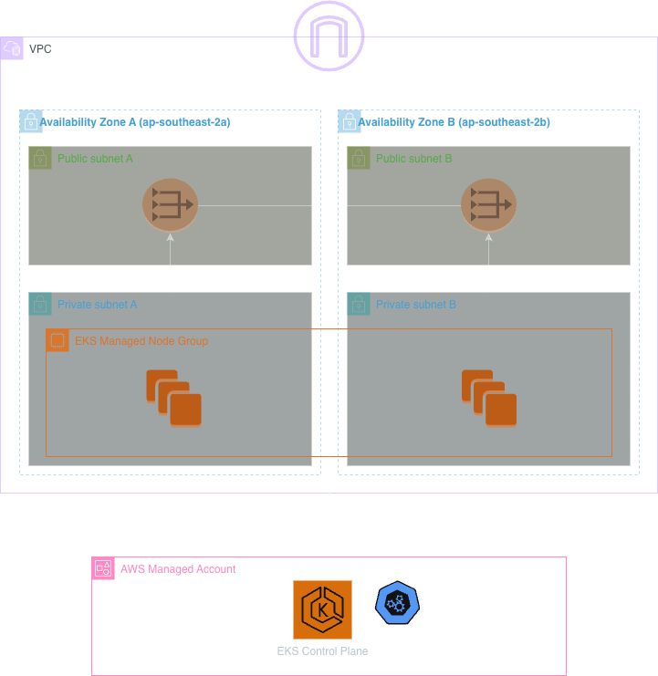

# Infra

This directory provisions the AWS platform roommate runs on (CloudFormation), and deploys the Kubernetes workloads on top of it (Helm).

## What's deployed

### CloudFormation (`cfn/`)

Four stacks, deployed in order by `deploy-infra-cfn.yaml`.

**`networking.yaml`**
- VPC
- Public + private subnets
- Internet Gateway
- NAT gateway(s)
- Route tables

**`eks.yaml`**
- EksClusterRole: lets the EKS control plane call other AWS APIs on your behalf
- NodeInstanceRole: lets worker nodes register with the cluster, use the VPC CNI, pull images from ECR, and be managed via SSM
- EKS cluster: the AWS managed control plain that runs and coordinates the cluster, targets all subnets in our VPC
- Managed node group: the EC2 nodes that run the pods, placed in the private subnets
- OIDC provider: enables IRSA, so a pod's service account can assume its own specific IAM role instead of inheriting the whole node's shared role
- ACM certificate: requested and DNS-validated upfront so that it's ready for when ingress needs it later on in deployment

**`karpenter.yaml`**
- Karpenter node IAM role: role given to ec2 nodes karpenter launches so they can join the cluster
- Karpenter controller IAM policy + role: role given to karpenter controller pods such that they can create and destroy ec2 nodes, can only be assumed via IRSA by pods with karpenter service account
- SQS interruption queue: receives spot interruption, instance health, and rebalance events so Karpenter can react before a node disappears
- EventBridge rules: forwards AWS events into the interruption queue
- Node security group: controls what traffic is allowed to/from Karpenter provisioned nodes and the control plane

**`cognito.yaml`**
- Cognito user pool: directory of users including accounts, passwords, verified emails, federated identities
- Google identity provider: lets users log in with an existing Google account instead of creating a new password. This is associated with our user pool
- User pool domain: hosted UI for login
- User pool client: config that strings together our domain, user pool, and identity providers. Will be used by our alb

### Helm (`helm/`)

**`karpenter controller`**
This chart is not defined by us, instead sourced from a public aws chart.

Deploys the karpenter autoscaling software onto our eks cluster.

**`karpenter/`**
Config that tells our karpenter controller what it is allowed to launch.

- ec2nodeclass: environment karpenter nodes are built into. Identity, network placement, and the base image
- nodepool: instance specs for karpenter nodes. Shape of instance (arch, pricing model, size category) and how much of it the pool is allowed to produce

**`app/`**
Deploys the actual application onto the infra (with the exception of the ingress which itself deploys new infra).

- Backend/Redis: replica pods (2 by default) running a container image, load-balanced internally via a ClusterIP Service
- Frontend: the same pattern (replica pods + ClusterIP Service), plus an Ingress in front of it. provisions new an ALB, attaches TLS + Cognito auth, and makes our cluster reachable from the internet

## Diagrams

### networking

### eks

